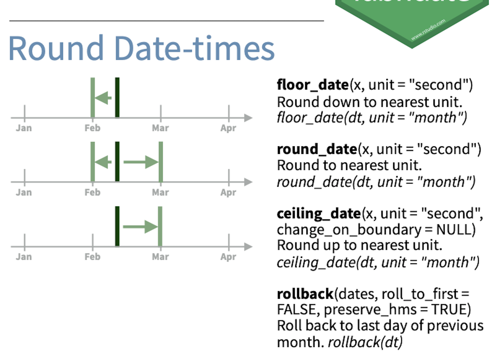

class: middle, center, middle

# Dates & Times 

<br><br>.large[Maria C. Ramos| Cohort 4: R4DS | 07 Apr 2021]

<br><br><br>`r icon::fa("link")`.large[mariacramos.com]
<br><br>`r icon::fa("twitter")`.large[@mariacramosf]
---
class: middle, center, center
```{r setup, include=FALSE}
options(htmltools.dir.version = FALSE)
knitr::opts_chunk$set(fig.retina = 3, warning = FALSE, message = FALSE)
library(tidyverse)
```
# Ice Breaker

Two Truths and One Lie

---
# Outline

* Generalities 

* Dates & Times Data Types

* Common Tasks 
 
 + Create data types
 + Pull out individual date components (the month, day, or hour)
 + Round dates
 + Set date components
 + Perform arithmetic operations with dates
 + Work with time zones
---

# Generalities 

## Package 

```{r}
library(lubridate)
```

** not part of the tidyverse **

---

# Date/Times Data Types 

.pull-left[
1. date
```{r, echo = FALSE}
tibble(my_date <- ymd("2021-04-07"))
```
]

.pull-right[
2. date-time
```{r, echo = FALSE}
library(nycflights13)
flights %>%
   select(time_hour) %>%
   print()
```
]

.center[**Work with the simplest data type you can**]

---

# Creating date and date times

1. From current date or date time<br>

2. From a string<br>

3. From unquoted numbers<br> 

4. From individual date-time components<br>

5. From an existing date, date-time object<br>

---
# Creating date and date times

## From current date or date time

.pull-left[
Current date
```{r}
today()#<<
```
]

.pull-right[
Current date-time
```{r}
now()#<<
```
]

---
#Creating date and date times

## From strings

**Approach 1: parsing (data import) **

**Approach 2: using lubridate helpers**

- Helpers: y, m, d to represent year, month, day, etc.<br>

- Identify the order in which the components appear in the data <br>

- Specify the order of the components in your data to parse <br>

```{r}
ymd("2017-01-31")
myd("01-2017-31")
```

---
#Creating date and date times

## From strings (examples)

```{r}
mdy("January 31st, 2017")

dmy("31-Jan-2017")

ymd_hms("2017-01-31 20:11:59")

mdy_hm("01/31/2017 08:01")
```

---
# Exercise

Which of helpers will correctly parse the date-time objects?

.pull-left[
"30/06/2020 06:01:01"
```{r,eval=FALSE}
myd("30/06/2020 06:01")
mdy_hms("30/06/2020 06:01:01")
dmy_hms("30/06/2020 06:01:01")
none of the above
```

]

.pull-right[
"April 7, 2021"
```{r,eval=FALSE}
myd_hms("April 7, 2021")
mdy_hms("April 7, 2021")
ymd("April 7, 2021")
none of the above
```
]
---
#Creating date and date times

## From unquoted number 

```{r}
ymd(20170131)
```

Adding the timezone
```{r}
ymd(20170131, tz = "UTC")
```

---
#Creating date and date times

## From individual components

use *make_date()* and *make_datetime()*
```{r, echo=FALSE}
library(nycflights13)
flights %>%
   select(flight, year, month, day, hour, minute) %>%
   print()
```

---
#Creating date and date times

## From individual components

use *make_date()* and *make_datetime()*
```{r}
flights %>%
   select(flight, year, month, day, hour, minute) %>%
   mutate(departure = make_date(year, month, day))%>%#<<
   print(n=5)
```

---
#Creating date and date times

## From an existing date, date-time object

To switch between date and date-time objects
```{r}
as_datetime(today())

as_date(now())

```

---
#Pulling out components

.center[
```{r, echo=FALSE}
dfn <- data.frame(x= c("year()", 
                       "month()", 
                       "mday()", 
                       "yday()",
                       "wday()", 
                       "hour()", 
                       "minute()", 
                       "second()"))
dfn %>%
   knitr::kable("html", 
                col.names = c("accessor function"))
```
]
---
#Pulling out components

.pull-left[
```{r}
datetime <- 
   ymd_hms("2021-04-07 12:34:56")
```
]

.pull-right[
```{r}
year(datetime)
month(datetime)
mday(datetime)
yday(datetime)
wday(datetime)
```
]
---

#Pulling out components

.pull-left[
```{r}
datetime <- 
   ymd_hms("2021-04-07 12:34:56")
```
]

.pull-right[
```{r}
month(datetime, 
      label = TRUE)#<<
wday(datetime, 
     label = TRUE, #<<
     week_start = 1) #<<
```
]

---
# Rounding Date-times


---
#Rounding Date-times
.pull-left[

]

.pull-right[
```{r}
x <- now()
floor_date(x, "month")
round_date(x, "month")
ceiling_date(x,"month")
rollback(x)
```

]
---
# Exercises
.center[
What should each of these rounding functions output?
```{r, eval=FALSE}
my_date <-  mdy_hms("01-26-2021 16:35:00")
floor_date(my_date, "hour")
round_date(my_date, "hour")
ceiling_date(my_date,"hour")
rollback(my_date)
```
]

---
# Solutions

```{r}
my_date <-  mdy_hms("01-26-2021 16:35:00")
floor_date(my_date, "hour")
round_date(my_date, "hour")
ceiling_date(my_date,"hour")
rollback(my_date)
```
---
# Setting components 

Using accessor functions 

*setting the year*
```{r}
x
year(x) <- 2020#<<
x
```

*setting the month*
```{r}
month(x) <- month(x)+1#<<
x
```

---
# Setting components 

Using update() function

*updating year*
```{r}
x
update(x, year = 2019)#<<
x
```

---
# Setting components 

Using update() function

*using rollover*
```{r}
ymd("2021-04-07") %>%
   update(mday = 31)

```
---
class: middle, center, center
#Next Week

Time Spans
---
class: center, middle

# Thanks!

Slides created via the R package [**xaringan**](https://github.com/yihui/xaringan).
